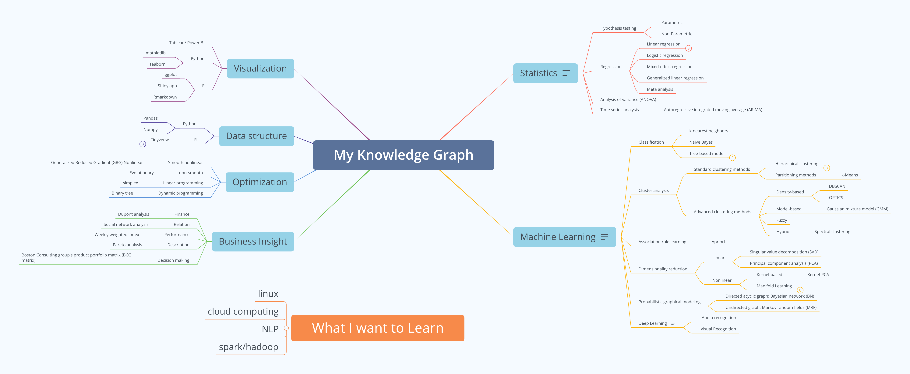

 

**Personal Profile**: 4+ years of researcher experience building complete data pipeline and applying statistical techniques and machine learning models to solve real-life problems. Ability to develop innovative and practical solutions to complex problems without direct technical supervision. 

**Long Term Goal**: To become a *Data Scientist* in delivering business insight with analytical technique. 

 

 

Contact me at weiquan.luo1221@gmail.com or find my latest projects on GitHub.

